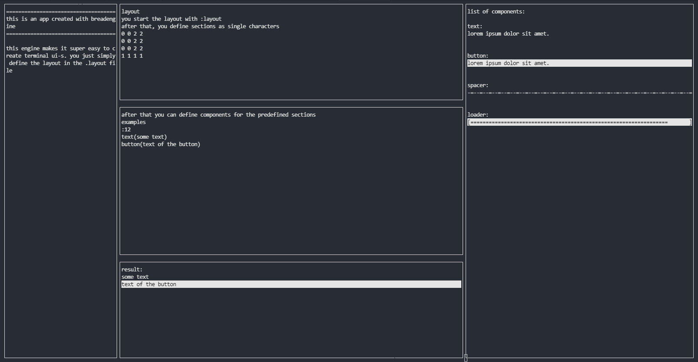

# 🍞 BreadEngine 🍞 - A terminal-ui engine

#Check out my blogpost
[http://blog.peterferencz.me/breadengine](http://blog.peterferencz.me/breadengine)

### Screenshots


###  Goal:
Generate an out of the box working console application which is generated from a layout file

### Install
Just clone the repository
```
git clone https://github.com/peterferencz/BreadEngine.git
```

### Contributing
Feel free to message me with ideas, or commit a pull request

### Legal
MIT license
